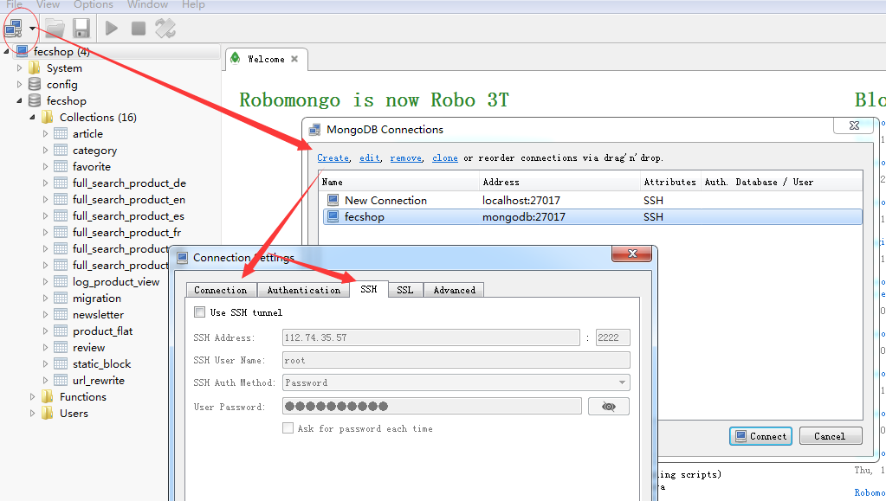

Fecshop 全称为Fancy ECommerce Shop，是基于php Yii2框架之上开发的一款优秀的开源电商系统， Fecshop支持多语言，多货币，架构上支持pc，手机web，手机app，和erp对接等入口，您可以免费快速的定制和部署属于您的电商系统。

Fecshop Github地址: https://github.com/fancyecommerce/yii2_fecshop

Fecshop Docker
=============


> 用于快速的，使用docker搭建fecshop的环境，方便快速部署，通过docker compopse
> 通过下载镜像，自己构建镜像，把fecshop需要的各个软件以及扩展都安装好，您
> 可以根据下面的说明操作

如果你对docker不熟悉，可以参看 [fecshop docker 安装视频](http://www.fecshop.com/doc/fecshop-guide/instructions/cn-1.0/guide-fecshop_video_docker_install.html)


小白用户
---------

对于小白用户，对docker了解的少，建议使用docker小白版安装教程安装：
https://github.com/fecshop/yii2_fecshop_docker_fool
，该教程将很多东西都给安装了，数据库文件等都已经安装好，配置下nginx就可以跑起来，
对docker了解的，建议使用该标准安装教程安装fecshop。


网络问题说明
------------

> docker-compose.yml，默认使用的是国外的源，如果您是国内的服务器，可能会遇到某些包被墙
，您可以按照下面的方法，使用阿里云的源，适合国内的用户下载安装docker环境

1.如果您在docker环境构建的过程中，出现因为网速问题，导致的安装失败，可以将 `docker-compose.yml.aliyun` 内容覆盖 `docker-compose.yml` ,全部使用阿里云
的镜像（镜像是由fecshop上传的）。

2.fecshop的代码是基于composer安装的，可能安装过程中拉取fecshop依赖的库包存在网络问题，您可以
使用`百度云盘完整版`, 下面有使用的说明

曾经有人遇到过这个问题，估计是网络问题：http://www.fecshop.com/topic/641


目录结构介绍
---------


`./app`: 这里是代码文件，fecshop的代码文件放到这里（打开后发现里面没有文件，这是因为fecshop的文件是需要composer安装后才会有的，因此，严格按照下面的操作步骤执行就好）,在后面又有安装步骤，进入php容器后，使用composer安装fecshop后，文件就在 ./app/fecshop文件下面

`./db`: 这里是环境部分-数据库部分

`./db/mongodb`: 这里是mongodb数据库的部分

`./db/mongodb/data`: 这里是数据库的数据存放的部分，也就是数据库的库表部分数据。

`./db/mongodb/example_db`: fecshop的mongodb示例数据

`./db/mongodb/etc/mongod.conf`: Mongodb数据库的配置文件


`./db/mongodb/logs`: Mongodb的logs部分


`./db/mysql`: mysql数据库

`./db/mysql/data`: mysql 数据库表数据存放的位置

`./db/mysql/example_db`: fecshop的mysql示例数据

`./db/mysql/conf.d`: mysql 配置文件

`./db/redis`: redis数据库

`./db/redis/data`: redis数据库的存储部分

`./db/redis/etc/redis.conf`: redis数据库的配置部分

`./db/redis/etc/redis-password`: redis数据库的密码文件

`./db/xunsearch`: xunsearch搜索引擎部分

`./db/xunsearch/data`: xunsearch搜索引擎的数据存储部分

`./example_data`: fecshop的示例数据部分


`./services`: 服务软件部分，譬如php nginx等

`./services/php`: php部分

`./services/php/docker/Dockerfile`: php镜像构建的dockerfile文件

`./services/php/etc/php7.1.13.ini`: php的配置文件

`./services/web`: nginx部分

`./services/web/nginx/conf`: nginx的配置部分

`./services/web/nginx/conf/conf.d/default.conf`：nginx 网站 server 部分的配置文件

`./services/web/nginx/logs`: nginx的log日志文件部分

`./docker-compose.yml`: docker compose配置文件


安装docker和docker compose
-------------------------

linux内核需要大约3.1.0 ,下面是centos 7 下面部署的过程：


1、安装docker

```
sudo curl -sSL https://get.daocloud.io/docker | sh
```

2、安装 docker compose，资料：[install-compose](https://docs.docker.com/compose/install/#install-compose)

```
sudo curl -L https://github.com/docker/compose/releases/download/1.18.0/docker-compose-`uname -s`-`uname -m` -o /usr/local/bin/docker-compose
```


### docker compose 安装部署环境

下载当前库文件，通过`git clone`下载：

```
mkdir -p /www/web
cd /www/web
git clone https://github.com/fecshop/yii2_fecshop_docker.git
```

1.进入上面下载完成后的文件夹 yii2_fecshop_docker，打开 `docker-compose.yml`

1.1更改mysql的密码：
```
- MYSQL_ROOT_PASSWORD=fecshopxfd3ffaads123456
```

1.2更改redis的密码：

```
打开文件：`./db/redis/etc/redis-password`,更改里面的redis密码即可。
```

mysql和redis的密码要记住，后面配置要用到。


2.构建：

启动docker

```
service docker start
```

> 第一次构建需要下载环境，时间会比较长，除了下载docker中心的镜像，还要构建镜像
> 看网速，如果用阿里云，15分钟差不多完成，使用下面的命令构建环境

```
chmod 755 /usr/local/bin/docker-compose
docker-compose build
```

### 网络问题解决

> docker-compose.yml，默认使用的是国外的源，如果您是国内的服务器，可能会遇到某些包被墙
，您可以按照下面的方法，使用阿里云的源，适合国内的用户下载安装docker环境

如果您在构建的过程中，出现因为网速问题，导致的安装失败，可以将 `docker-compose.yml.aliyun` 内容覆盖 `docker-compose.yml` ,全部使用阿里云
的镜像（镜像是由fecshop上传的）。

曾经有人遇到过这个问题，估计是网络问题：http://www.fecshop.com/topic/641


完成后，运行：

```
docker-compose up  // 按下ctrl+c退出停止。
```

后台运行：（守护进程的方式）

```
docker-compose up -d
```

查看compose启动的各个容器的状态：

```
docker-compose ps
```

进入某个容器,譬如php：

```
docker-compose exec php bash
```

退出某个容器

```
exit
```


停止 docker compose启动的容器：

```
docker-compose stop
```

到这里我们的环境就安装好了，也讲述了一些docker compose常用的命令，
下面我们测试一下我们的环境


### 启动docker ，下载安装fecshop


> 对于docker ，一定要切记，docker不是虚拟机！docker不是虚拟机！docker不是虚拟机！
> 每一个服务，对应一个docker 容器，譬如mysql
> 一个容器，php一个容器，redis一个容器，mongdob一个容器，
> 每一个容器的数据和配置文件都是在宿主主机上面，通过`volumes`
> 挂载到容器的相应文件夹中，（我们在`./docker-compose.yml`
> 配置文件中的`volumes`做了映射）
>
> 因此，对于docker 容器，里面涉及到存储的部分，都应该通过
> 挂载的方式映射到宿主机上面，而不是在容器里面。

`宿主机`: 就是您的linux主机

`容器主机`：就是docker容器虚拟的主机。


1、启动:

进入yii2_fecshop_docker目录，执行：

`docker-compose up -d`


2、composer 安装fecshop

我们通过命令进入到php的容器：

```
docker-compose exec php  bash
```
// 进入成功后，在php容器中执行：
```
cd /www/web
```

**最新的fecshop版本参看**：https://github.com/fecshop/yii2_fecshop/releases
，
将`1.4.4.0` 替换成相应的fecshop版本。

```
composer create-project fancyecommerce/fecshop-app-advanced fecshop 1.4.4.0
```

**一定要将 1.4.4.0 替换成最新的版本！！**  **一定要将 1.4.4.0 替换成最新的版本！！**

**一定要将 1.4.4.0 替换成最新的版本！！**  **一定要将 1.4.4.0 替换成最新的版本！！**


如果你是第一次使用github，会提示需要token，参看这里获取Token：http://www.fecshop.com/topic/412

下载的时候，如果你是第一次使用github，这个地方会卡住，提示你填写github的token，获取github token 参看帖子：http://www.fecshop.com/topic/412

```
Head to https://github.com/settings/tokens/new?scopes=repo&description=Composer+on+b3817f538307+2018-06-12+1503
to retrieve a token. It will be stored in "/root/.composer/auth.json" for future use by Composer.
Token (hidden):
```


如果上面的composer安装报错：composer安装fxp插件时候内存不足提示提示Fatal error: Uncaught exception 'ErrorException' with message 'proc_open(): fork failed - Cannot allocate memory' in phar，说明内存不够，参看这里解决：
http://www.fecshop.com/topic/612


```
cd fecshop
composer update
./init
```

执行的log详细

```
root@21b9518c220b:/www/web/fecshop# ./init
bash: ./init: Permission denied
root@21b9518c220b:/www/web/fecshop# chmod 755 ./init
root@21b9518c220b:/www/web/fecshop# ./init
Yii Application Initialization Tool v1.0

Which environment do you want the application to be initialized in?

  [0] Development
  [1] Production

  Your choice [0-1, or "q" to quit] 0

  Initialize the application under 'Development' environment? [yes|no] yes

  Start initialization ...

   generate yii
   generate apphtml5/merge_config.php
   generate apphtml5/web/cn/index.php
   generate apphtml5/web/cn/sitemap.xml
   generate apphtml5/web/cn/robots.txt
   generate apphtml5/web/fr/index.php
   generate apphtml5/web/fr/sitemap.xml
   generate apphtml5/web/fr/robots.txt
   generate apphtml5/web/sitemap_es.xml
   generate apphtml5/web/index.php
   generate apphtml5/web/sitemap.xml
   generate apphtml5/web/index-test.php
   generate apphtml5/web/index-merge-config.php
   generate apphtml5/web/robots.txt
   generate apphtml5/config/main-local.php
   generate apphtml5/config/params-local.php
   generate appapi/merge_config.php
   generate appapi/web/index.php
   generate appapi/web/index-test.php
   generate appapi/web/index-merge-config.php
   generate appapi/config/main-local.php
   generate appapi/config/params-local.php
   generate console/config/main-local.php
   generate console/config/params-local.php
   generate appadmin/web/index.php
   generate appadmin/web/index-test.php
   generate appadmin/config/main-local.php
   generate appadmin/config/params-local.php
   generate appfront/merge_config.php
   generate appfront/web/cn/index.php
   generate appfront/web/cn/sitemap.xml
   generate appfront/web/cn/robots.txt
   generate appfront/web/fr/index.php
   generate appfront/web/fr/sitemap.xml
   generate appfront/web/fr/robots.txt
   generate appfront/web/sitemap_es.xml
   generate appfront/web/index.php
   generate appfront/web/sitemap.xml
   generate appfront/web/index-test.php
   generate appfront/web/index-merge-config.php
   generate appfront/web/robots.txt
   generate appfront/config/main-local.php
   generate appfront/config/params-local.php
   generate appserver/merge_config.php
   generate appserver/web/index.php
   generate appserver/web/index-test.php
   generate appserver/web/index-merge-config.php
   generate appserver/config/main-local.php
   generate appserver/config/params-local.php
   generate tests/codeception/config/config-local.php
   generate common/config/main-local.php
   generate common/config/params-local.php
   generate cookie validation key in appadmin/config/main-local.php
   generate cookie validation key in appapi/config/main-local.php
   generate cookie validation key in appfront/config/main-local.php
   generate cookie validation key in apphtml5/config/main-local.php
   generate cookie validation key in appserver/config/main-local.php
      chmod 0777 appadmin/runtime
      chmod 0777 appadmin/web/assets
      chmod 0777 appapi/runtime
      chmod 0777 appapi/web/assets
      chmod 0777 appfront/runtime
      chmod 0777 appfront/web/assets
      chmod 0777 appfront/web/cn/assets
      chmod 0777 appfront/web/fr/assets
      chmod 0777 appfront/web/sitemap.xml
      chmod 0777 appfront/web/sitemap_es.xml
      chmod 0777 appfront/web/fr/sitemap.xml
      chmod 0777 appfront/web/cn/sitemap.xml
      chmod 0777 apphtml5/runtime
      chmod 0777 apphtml5/web/assets
      chmod 0777 apphtml5/web/sitemap.xml
      chmod 0777 apphtml5/web/sitemap_es.xml
      chmod 0777 apphtml5/web/fr/sitemap.xml
      chmod 0777 apphtml5/web/cn/sitemap.xml
      chmod 0777 appserver/runtime
      chmod 0777 appserver/web/assets
      chmod 0777 appimage/common/media/catalog/product
      chmod 0755 yii
      chmod 0755 tests/codeception/bin/yii

  ... initialization completed.

root@21b9518c220b:/www/web/fecshop#
```


执行完后，通过composer加载的文件就完成了。


> 参考资料：[Fecshop 安装](http://www.fecshop.com/doc/fecshop-guide/develop/cn-1.0/guide-fecshop-about-hand-install.html)

2.2 百度云盘完整版

> 通过百度网盘安装(不建议),如果因为墙无法使用composer，可以访问百度云盘，
> 下载地址为：http://pan.baidu.com/s/1hs1iC2C 下载日期最新的压缩包即可

如果您使用的是百度云盘完整版，
那么将文件解压到宿主机 `./app/` 下面即可，将文件夹的名字改成`fecshop`
，完成后  `./app/fecshop` 就是fecshop系统包的根目录

```
cd fecshop
./init
```

完成后，使用`exit`退出php的docker容器

> 参考资料：[Fecshop 安装](http://www.fecshop.com/doc/fecshop-guide/develop/cn-1.0/guide-fecshop-about-hand-install.html)


### 配置fecshop


> 参考：[Fecshop 初始配置](http://www.fecshop.com/doc/fecshop-guide/develop/cn-1.0/guide-fecshop-about-config.html)

> 为了更方便的配置，Terry在 `./example_data/` 中已经进行了一些默认配置，
> 您可以按照自己的需要，在默认配置的基础上修改一部分配置，譬如数据库，域名等，然后将`./example_data/fecshop/*`的内容覆盖到`./app/fecshop`中，
> 下面介绍的是在`./example_data/`里面修改各个配置，然后将配置覆盖到`./app/fecshop`中


1、添加域名hosts映射（也就是用ip映射的方式弄假域名），本机（浏览器所在的电脑，也就是您的window本机），添加host(打开C:\Windows\System32\drivers\etc\hosts，添加如下代码,如果是其他IP，将 127.0.0.1 替换成其他IP即可。)

```
127.0.0.1       my.fecshop.com       # mysql的phpmyadmin的域名指向
127.0.0.1       appadmin.fecshop.com # 后台域名指向
127.0.0.1       appfront.fecshop.com # 前台pc端域名指向
127.0.0.1       appfront.fecshop.es  # 前台pc端 es 语言的域名指向
127.0.0.1       apphtml5.fecshop.com # 前台html端的域名指向
127.0.0.1       appapi.fecshop.com   # api端的域名指向
127.0.0.1       appserver.fecshop.com # server端的域名指向
127.0.0.1       img.fecshop.com		#appimage/common   图片的域名指向
127.0.0.1       img2.fecshop.com	#appimage/appadmin 图片的域名指向
127.0.0.1       img3.fecshop.com	#appimage/appfront 图片的域名指向
127.0.0.1       img4.fecshop.com	#appimage/apphtml5 图片的域名指向
127.0.0.1       img5.fecshop.com	#appimage/appserver图片的域名指向
```

**注意：上面的host映射，需要将`#符号`以及后面的注释部分去掉**

譬如：将 `127.0.0.1       my.fecshop.com       # mysql的phpmyadmin的域名指向` 改成 `127.0.0.1       my.fecshop.com` , 有一些童鞋没有去掉
后面的注释，而导致host映射没有生效

2.更改`./example_data`里面的配置文件

> fecshop有一些列的配置，Terry在 `./example_data`下面已经进行了一些列的默认配置，你可以按照自己的需要进行修改，譬如设置一些数据库密码之类的配置，
最后通过`cp`命令将这些配置文件覆盖到 `./app/fecshop`里面即可。

2.1数据库配置：

打开 ./example_data/fecshop/common/config/main-local.php
,将mysql的密码，redis的密码，以及redis在session cache中使用的密码，都配置一下，
密码使用上面进设置的密码。

> 注意：修改数据库配置文件的时候，不要将各个数据库的host修改成`127.0.0.1`，使用默认配置的host即可（docker会通过host映射到相应的容器内网ip，各个容器是隔离的，各个容器的内网ip不是127.0.0.1）,否则，将会出现无法连接的问题，关于这个，详细参看：http://www.fecshop.com/topic/935

3.配置域名 **默认对应1步骤的host对应的域名(上面配置的win hosts里面的域名)，使用默认即可，如果您要自定义域名，那么修改成你自己的域名**

> 如果您使用上面的默认域名，也就是上面配置的win hosts里面的域名，那么下面的步骤不需要操作，但是，如果您使用的阿里云这些国内的服务器厂商，他们是需要域名备案的，使用本地host映射的方式是不行的，您需要自己买个域名备案，然后才能使用，因此，您需要将fecshop里面的默认域名改成您自己的域名，您需要按照下面的步骤修改

nginx的配置文件为`./services/web/nginx/conf/conf.d/default.conf`


3.1修改各个入口的域名，也就是各个Store的配置

首先在nginx的配置文件中修改各个入口的域名的配置

然后修改fecshop中的各个域名的配置，打开 `./example_data/fecshop/`， 三个入口的store配置

```
@appfront/config/fecshop_local_services/Store.php

@apphtml5/config/fecshop_local_services/Store.php

@appserver/config/fecshop_local_services/Store.php
```

关于域名配置的详细，您可以参考:[Fecshop配置](http://www.fecshop.com/doc/fecshop-guide/develop/cn-1.0/guide-fecshop-about-config.html)，的第4部分。

3.2如果您想修改图片的域名（修改成自定义），在nginx配置中修改域名后，
还需要到fecshop中配置图片域名，fec配置文件地址为：`./example_data/fecshop/common/config/fecshop_local_services/Image.php`

上面是一个nginx配置的过程，对于不熟悉nginx的人，先去了解一下nginx知识吧。

nginx里面的图片域名对应一个文件路径，fec配置文件地址`./example_data/fecshop/common/config/fecshop_local_services/Image.php`里面的配置也有文件路径，
如果您要使用自己的域名，这个要对应好地址，否则图片无法访问。


4.上面我们将配置文件修改完成了，下面，我们将配置覆盖到fecshop的目录里

4.1将配置文件`./example_data/fecshop/*` 覆盖到 `./app/fecshop/`

进入`./example_data/`文件夹，执行：

```
// 复制配置文件到fecshop目录，也就是上面3步骤中的各个store 域名 以及数据库配置文件，复制到./app/fecshop目录中
\cp -rf ./fecshop/* ../app/fecshop/
// 解压产品图片到./app/fecshop目录中
unzip -o ./example_img_and_db_data/appimage.zip  -d  ../app/fecshop/
```

> 此步骤，复制文件，非常重要，请务必保证复制成功完成, 有不少童鞋都是这个步骤导致出现各种问题的，复制完可以自己核对一下，是否复制成功

5.Yii2 migrate方式导入表结构。

```
docker-compose exec php bash
cd /www/web/fecshop
```
mysql(导入mysql的表，数据，索引):

```
./yii migrate --interactive=0 --migrationPath=@fecshop/migrations/mysqldb
```

mongodb(导入mongodb的表，数据，索引):

```
./yii mongodb-migrate  --interactive=0 --migrationPath=@fecshop/migrations/mongodb
```

`exit`，退出容器,回到宿主主机

6.测试数据

6.1安装mongodb数据库的测试数据

在根目录下（github下载完成后的文件夹下）进入mongodb容器

```
docker-compose exec mongodb bash
```

```
mongo mongodb:27017/fecshop --quiet /data/example_db/mongo-fecshop_test-20170419-065157.js
```

`exit`，退出容器,回到宿主主机

6.2安装mysql数据库的测试数据

在根目录(docker-compose.yml文件所在目录)下执行，进入mysql的容器

```
docker-compose exec mysql bash
```

执行`mysql -uroot -p` 进入mysql

```
use fecshop;
source /var/example_db/mysql_fecshop.sql
exit
```

`exit`，退出容器,回到宿主主机

9.初始化搜索引擎数据


在根目录(docker-compose.yml文件所在目录)下执行，进入php的容器

```
docker-compose exec php bash
```

> ubuntu 6.10 开始，ubuntu 就将先前默认的bash shell 更换成了dash shell；其表现为 /bin/sh 链接倒了/bin/dash而不是传统的/bin/bash。
> 详细参看： http://blog.csdn.net/liuqinglong_along/article/details/52191382

修改：

```
dpkg-reconfigure dash
然后填写no，
```

9.3.然后执行

```

cd /www/web/fecshop/vendor/fancyecommerce/fecshop/shell/search
sh fullSearchSync.sh    //ubuntu下面用bash
```

如果没有报错，就完成了，执行`exit`退出php容器。

这样，我们基本配置完成了，因为上面更改了很多配置，因此需要执行 docker-compose 重启(注意要到宿主主机的`yii2_fecshop_docker`文件夹下面执行)

```
docker-compose stop
docker-compose up -d
```

然后就可以访问了

10.后台的默认用户名密码

可以访问各个入口了,如果您的域名配置是上面的默认配置那么：

前端pc: `appfront.fecshop.com`

前端html5：`apphtml5.fecshop.com`

appapi： `appapi.fecshop.com`

appserver: `appserver.fecshop.com`

后台appadmin： `appadmin.fecshop.com` , 后台的账户密码： `admin`  `admin123`


console： `对于console的执行，需要进入php的容器，在 /www/web/fecshop中执行。`

### 配置开机启动

1.centos7下面开机启动docker

```
systemctl enable docker
```

2.开机启动docker-compose

`vim /etc/rc.d/rc.local` , 新行，添加下面的命令行

```
/usr/local/bin/docker-compose -f /www/web/yii2_fecshop_docker/docker-compose.yml up -d
```

注意，要将`/www/web/yii2_fecshop_docker` 替换成您自己的地址。

### 安装VUE部分

> VUE的数据提供部分是上面的appserver入口提供的api，因此，需要上面的配置完成后，才可以配置下面的vue部分

在宿主主机中操作：

1.进入 `yii2_fecshop_docker/app `, 也就是将 vue_fecshop_appserver 下载到`yii2_fecshop_docker/app/ `下面

参看文档：https://github.com/fecshop/vue_fecshop_appserver
，进行下载，安装环境


2.上面的文档操作过程中，到第6步完成后，执行

```
npm run build
```

就可以访问：http://vue.fecshop.com
了，因为nginx默认已经配置了这个域名，可以直接访问。

OK,fecshop docker compose的安装过程完成了。

是不是，so easy？，，，，妈妈再也不用担心我繁琐的安装fecshop了。


### GUI访问数据库

1.mongodb的访问

推荐使用RoboMongo，下载地址为：https://robomongo.org/download
，支持使用ssh方式访问mongodb

默认的方式是无法连接的，我们需要搭建一个ssh的容器，通过这个容器连接mongodb

1.1 本部分参考的教程为：[Dockerize an SSH service](https://docs.docker.com/engine/examples/running_ssh_service/#build-an-eg_sshd-image)

1.2 打开文件：./services/ssh/docker/Dockerfile , 找到配置行：`RUN echo 'root:setyoupasss22XXXcreencast' | chpasswd`
,将`setyoupasss22XXXcreencast` 改成您自己的root密码，切记，这里一定要修改，！！！这里一定要修改，！！！
这里一定要修改，！！！

1.3 打开根目录的 `docker-compose.yml`, 在配置的services中加入：

```
ssh1:
    build:
      context: ./services/ssh/docker/
    networks:
      - code-network
    ports:
      - "2222:22"
```


加入后的配置示例如下：

**下面只是给一个例子参考，切勿复制下面的文件覆盖你的docker-compose.yml**

**下面只是给一个例子参考，切勿复制下面的文件覆盖你的docker-compose.yml**

**下面只是给一个例子参考，切勿复制下面的文件覆盖你的docker-compose.yml**

```
version: "2"
services:
  web:
    image: nginx
    ports:
      - "80:80"
    restart: always
    volumes:
      - ./app:/www/web
      - ./services/web/nginx/conf:/etc/nginx
      - ./services/web/nginx/logs:/www/web_logs
    networks:
        - code-network
    depends_on:
      - php
  ...  // 省略
  redis:
    image: redis
    restart: always
    ports:
      - "6379:6379"
    environment:
        REDIS_PASS_FILE: /run/secrets/redis-password
    command: [
      "bash", "-c",
      '
       docker-entrypoint.sh
       --requirepass "$$(cat $$REDIS_PASS_FILE)"
      '
    ]
    volumes:
      - ./db/redis/etc/redis.conf:/usr/local/etc/redis/redis.conf
      - ./db/redis/data:/data
      - ./db/redis/etc/redis-password:/run/secrets/redis-password
    networks:
      - code-network
  mongodb:
    image: mongo:3.7
    restart: always
    environment:
      - MONGO_DATA_DIR=/data/db
      - MONGO_LOG_DIR=/data/logs
    volumes:
      - ./db/mongodb/data:/data/db
      - ./db/mongodb/example_db:/data/example_db
      - ./db/mongodb/logs:/data/logs
    networks:
      - code-network
  ssh1:
    build:
      context: ./services/ssh/docker/
    networks:
      - code-network
    ports:
      - "2222:22"
networks:
  code-network:
    driver: bridge
```
1.4设置mongodb容器， mongod.conf配置文件里面的ip访问，允许ssh1容器访问mongodb

打开文件`db/mongodb/etc/mongod.conf`，将29行`bindIp: php`,改成 `bindIp: php,ssh1`，保存

重启docker-compose


1.5下载robomongo，打开mongodb connects窗口。然后点击create，在弹出的窗口中有connection，ssh 和其他的tab块



1.5.1 connection中填写： type：`redirect connection`，name：`fecshop`，Addredd：`mongodb` : `27017`

1.5.2 点击SSH，勾选Use SSH tunnel，然后进行如下填写：


ssh address ： `您的主机IP`：`2222`

ssh User Name : `root`

ssh Auth Method: 选择`password`方式

User Password：填写上面1.2部分，在文件./services/ssh/docker/Dockerfile
中填写的`密码`

点击save ，然后进行连接即可

2.mysql的访问

使用phpmyadmin

```
cd ./app
wget https://files.phpmyadmin.net/phpMyAdmin/4.7.7/phpMyAdmin-4.7.7-all-languages.zip
unzip phpMyAdmin-4.7.7-all-languages.zip
mv phpMyAdmin-4.7.7-all-languages  phpmyadmin
cd phpmyadmin/
vim libraries/config.default.php
//打开文件后，大约117行处，将
$cfg['Servers'][$i]['host'] = 'localhost';
改成
$cfg['Servers'][$i]['host'] = 'mysql';
保存退出即可
```

访问：my.fecshop.com 即可，mysql的密码就是docker-compose.yml文件中创建mysql容器的密码。

> 对于 my.fecshop.com，nginx下的配置文件已经配置好,nginx配置文件为：
`/services/web/nginx/conf/conf.d/default.conf`

OK，是不是so easy？ 不光妈妈，就连爸爸也不担心我繁琐的配置fecshop的环境，^-^,,

---------------------------------------------------------------------------
帮助：

> 在使用docker的时候有很多东西的安装可能不习惯， 下面有一些帮助文章

1.如何配置https，Docker容器环境中用Let's Encrypt部署HTTPS

详细： http://www.fecshop.com/topic/1249

2.docker-compose 计划任务cron，执行某个容器里面的shell脚本或者二进制可执行文件

详细： http://www.fecshop.com/topic/1296


---------------------------------------------------------------------------

QA:

1.安装的时候，在构建php的时候报错，怎么办？

答：您可以将文件 	docker-compose.yml.aliyun 的内容复制到  	docker-compose.yml 中，然后执行下面的命名构建

```
docker-compose build --no-cache
```
docker-compose.yml.aliyun中添加了做好了的php镜像，地址放到了阿里云docker镜像中心，国内建议使用该文件

docker-compose.yml.php.hub： php镜像放到了hub.docker.com ，国外服务器使用该地址


