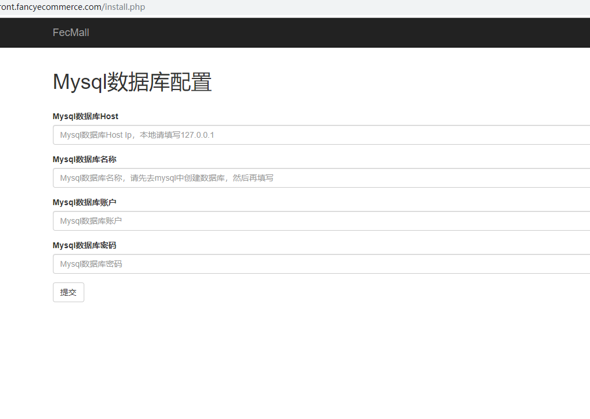
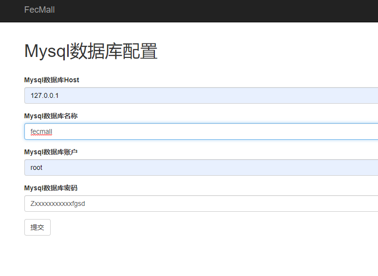
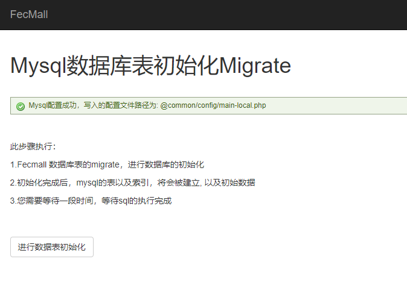
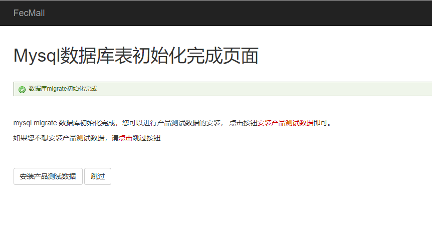
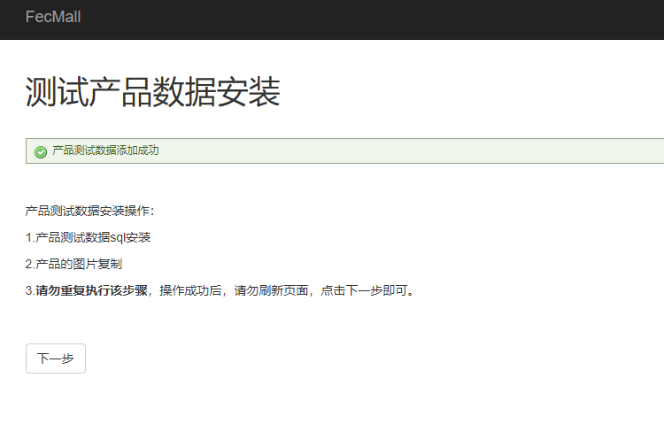
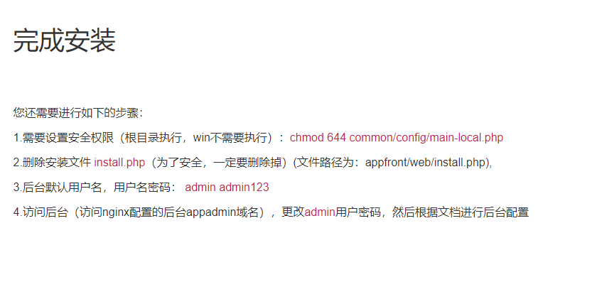
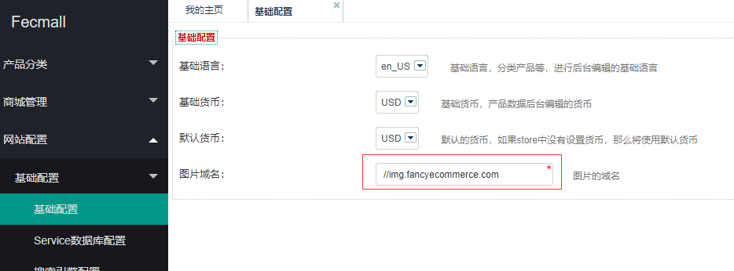
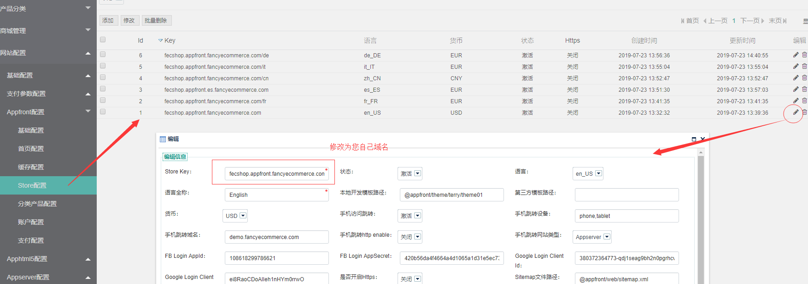
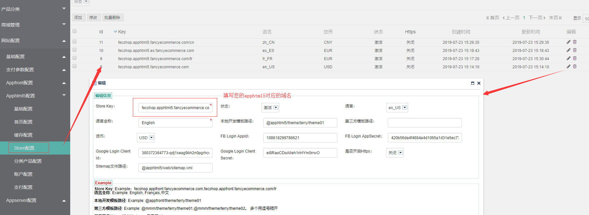
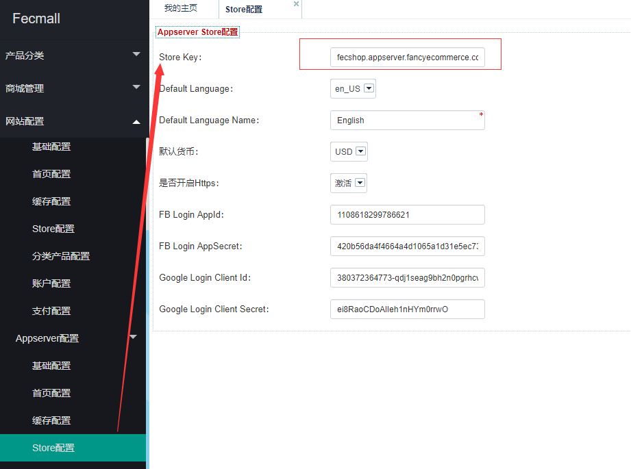

Fecshop 全称为Fancy ECommerce Shop，是基于php Yii2框架之上开发的一款优秀的开源电商系统， Fecshop支持多语言，多货币，架构上支持pc，手机web，手机app，和erp对接等入口，您可以免费快速的定制和部署属于您的电商系统。

Fecshop Github地址: https://github.com/fancyecommerce/yii2_fecshop

Fecshop Docker
=============


> 1.Fecshop-1.x版本的Docker安装参看：[Fecshop-1.x版本Docker安装教程](README-1.md)
> 
> 2.Fecshop 2.1和2.2版本，参看文档：[Fecshop-2.x版本Docker安装教程](README-2.2.md)
>
> 3.Fecshop 2.3以上的版本，参看本文安装教程（2.3.2版本以上）

网络问题说明
------------

> docker-compose.yml，默认使用的是国外的源，如果您是国内的服务器，可能会遇到某些包被墙
，您可以按照下面的方法，使用阿里云的源，适合国内的用户下载安装docker环境

国内用户，如果您在docker环境构建的过程中，出现因为网速问题，导致的安装失败，可以将 `docker-compose.yml.aliyun` 内容覆盖 `docker-compose.yml` ,全部使用阿里云
的镜像（镜像是由fecshop上传的）。


目录结构介绍
---------

[目录结构介绍](README-FILE.md)


安装docker和docker compose
-------------------------

linux内核需要大约3.1.0 ,下面是centos 7 下面部署的过程：


1、安装docker

```
sudo curl -sSL https://get.daocloud.io/docker | sh
```

2、安装 docker compose，资料：[install-compose](https://docs.docker.com/compose/install/#install-compose)

```
sudo curl -L https://github.com/docker/compose/releases/download/1.18.0/docker-compose-`uname -s`-`uname -m` -o /usr/local/bin/docker-compose
```


### docker compose 安装部署环境

下载当前库文件，通过`git clone`下载：

```
mkdir -p /www/web
cd /www/web
git clone https://github.com/fecshop/yii2_fecshop_docker.git
```

1.进入上面下载完成后的文件夹 yii2_fecshop_docker，打开 `docker-compose.yml`

1.1更改mysql的密码：
```
- MYSQL_ROOT_PASSWORD=fecshopxfd3ffaads123456
```

1.2更改redis的密码：（如果您不需要redis，那么这个部分忽略,fecmall默认不需要redis）

```
打开文件：`./db/redis/etc/redis-password`,更改里面的redis密码即可。
```

mysql和redis的密码要记住，后面配置要用到。


2.构建：

启动docker

```
service docker start
```

> 第一次构建需要下载环境，时间会比较长，除了下载docker中心的镜像，还要构建镜像
> 看网速，如果用阿里云，15分钟差不多完成，使用下面的命令构建环境

```
chmod 755 /usr/local/bin/docker-compose
docker-compose build
```

### 网络问题解决

> docker-compose.yml，默认使用的是国外的源，如果您是国内的服务器，可能会遇到某些包被墙
，您可以按照下面的方法，使用阿里云的源，适合国内的用户下载安装docker环境

如果您在构建的过程中，出现因为网速问题，导致的安装失败，可以将 `docker-compose.yml.aliyun` 内容覆盖 `docker-compose.yml` ,全部使用阿里云
的镜像（镜像是由fecshop上传的）。

曾经有人遇到过这个问题，估计是网络问题：http://www.fecshop.com/topic/641


完成后，运行：

```
docker-compose up  // 按下ctrl+c退出停止。
```

后台运行：（守护进程的方式）

```
docker-compose up -d
```

查看compose启动的各个容器的状态：

```
docker-compose ps
```

进入某个容器,譬如php：

```
docker-compose exec php bash
```

退出某个容器

```
exit
```


停止 docker compose启动的容器：

```
docker-compose stop
```

到这里我们的环境就安装好了，也讲述了一些docker compose常用的命令，
下面我们测试一下我们的环境


### 启动docker ，下载安装fecshop


> 对于docker ，一定要切记，docker不是虚拟机！docker不是虚拟机！docker不是虚拟机！
> 每一个服务，对应一个docker 容器，譬如mysql
> 一个容器，php一个容器，redis一个容器，mongdob一个容器，
> 每一个容器的数据和配置文件都是在宿主主机上面，通过`volumes`
> 挂载到容器的相应文件夹中，（我们在`./docker-compose.yml`
> 配置文件中的`volumes`做了映射）
>
> 因此，对于docker 容器，里面涉及到存储的部分，都应该通过
> 挂载的方式映射到宿主机上面，而不是在容器里面。

`宿主机`: 就是您的linux主机

`容器主机`：就是docker容器虚拟的主机。


1、启动:

进入yii2_fecshop_docker目录，执行：

`docker-compose up -d`


2、composer 安装fecshop

我们通过命令进入到php的容器：

```
docker-compose exec php  bash
cd /www/web
```

如果您是国内的主机，可以切换composer源为阿里云源

```
composer config -g repo.packagist composer https://mirrors.aliyun.com/composer/
```


**最新的fecshop版本参看**：https://github.com/fecshop/yii2_fecshop/releases
，
将`2.3.2` 替换成相应的fecshop版本。

```

composer create-project fancyecommerce/fecshop-app-advanced fecshop 2.3.2
```

**一定要将 2.3.2 替换成最新的版本！！**  **一定要将 2.3.2 替换成最新的版本！！**

**一定要将 2.3.2 替换成最新的版本！！**  **一定要将 2.3.2 替换成最新的版本！！**


如果你是第一次使用github，会提示需要token，参看这里获取Token：http://www.fecshop.com/topic/412

下载的时候，如果你是第一次使用github，这个地方会卡住，提示你填写github的token，获取github token 参看帖子：http://www.fecshop.com/topic/412

```
Head to https://github.com/settings/tokens/new?scopes=repo&description=Composer+on+b3817f538307+2018-06-12+1503
to retrieve a token. It will be stored in "/root/.composer/auth.json" for future use by Composer.
Token (hidden):
```


3.百度云盘完整版

> 通过百度网盘安装(不建议),如果因为墙无法使用composer，可以访问百度云盘，
> 下载地址为：http://pan.baidu.com/s/1hs1iC2C 下载日期最新的压缩包即可

如果您使用的是百度云盘完整版，
那么将文件解压到宿主机 `./app/` 下面即可，将文件夹的名字改成`fecshop`
，完成后  `./app/fecshop` 就是fecshop系统包的根目录


### init初始化

进入php容器(/www/web/yii2_fecshop_docker目录下执行)

```
docker-compose exec php  bash
```


进入fecshop根目录，执行`init`

```
cd /www/web/fecshop
./init
```

完成init初始化后，退出php容器

```
exit
```


执行完后，通过composer加载的文件就完成了。


完成后，使用`exit`退出php的docker容器

这样，我们部署完成了docker，并且下载了fecshop，并进行了初始化


### 配置fecshop


1.准备域名

> Fecmall是一个多入口的电商系统，各个入口独立访问，对应独立的子域名如下：


Pc端：`appfront.fecshoptest.com`

后台：`appadmin.fecshoptest.com`

图片：`img.fecshoptest.com`

H5端: `apphtml5.fecshoptest.com`(如果不安装h5，vue等入口，可以不准备)

移动Api端：`appserver.fecshoptest.com`  (如果不安装微信小程序，vue等入口，可以不准备)
 
第三方数据对接Api端：`appapi.fecshoptest.com` (如果不和第三方系统进行数据对接，可以不准备)

将上面的域名（替换成您自己的域名）解析到您的服务器，
如果您是在本地，可以在host文件中做虚拟域名指向127.0.0.1即可


nginx的配置文件为`./services/web/nginx/conf/conf.d/default.conf`

如果您使用自定义域名，将其配置域名替换即可

然后重启docker

```
docker-compose stop
docker-compose up -d
```

Fecmall界面安装
----------------

1.在上面的步骤中，配置了nginx, 您配置好域名后，appfront对应域名配置为：`appfront.fecshoptest.com`   >  `$root/appfront/web/`

安装入口文件为：`$root/appfront/web/install.php`
, 打开安装地址： http://appfront.fecshoptest.com/install.php （替换成您自己的域名）




mysql的数据库和用户名密码，就是`docker-compose.yml`里面配置的mysql参数，
注意，host不要填写`127.0.0.1`,**而是填写`mysql`**

2.填写mysql的配置，点击提交



提交后，如图：



mysql的配置写入了配置文件：`@common/config/main-local.php`


点击按钮： `进行数据表初始化`，需要一段时间执行（请耐心等待），执行完成后的界面如下：





点击`测试产品数据安装`，完成后界面（如果不想安装测试数据，可以点击`跳过`按钮）




点击`下一步`按钮，进入完成安装界面




您可以进入mysql查看一下数据表是否已经创建，然后查看一下`product_flat`表里面是否有数据，进行数据库初始化以及
测试数据安装成功确认。


3.您还需要进行如下的步骤：

3.1需要设置`安全权限`（根目录执行，win不需要执行）：`chmod 644 common/config/main-local.php`

3.2删除安装文件 install.php（**为了安全，一定要删除掉**）(文件路径为：`./app/fecshop/appfront/web/install.php`),


Fecmall访问后台，进行后台配置
-----------------------

也就是上面配置的域名：`appadmin.fecshoptest.com`

初始账户密码：  `admin`  `admin123`

右上角切换成`中文语言`。

**首先配置图片域名** 

`网站配置`-->`基础配置`-->`基础配置`  找到`图片域名`，填写您的图片域名，譬如：`//img.fecshoptest.com`
(前面不要加`http:`,这种方式http和https都可以调用图片url,将该域名替换成您自己的域名)



3.1后台添加`appfront`(PC)配置，添加`store`


`网站配置`-->`Appfront配置`-->`Store配置`

可以看到`store`列表，点击`id为1`的数据（激活状态），进行编辑，将域名更改成 `appfront.fecshoptest.com`(替换成您自己的域名)，保存

然后就可以访问：appfront.fecshoptest.com ，查看pc端了




3.2配置Apphtml5

`网站配置`-->`Apphtml5配置`-->`Store配置`

可以看到store列表，点击`id为8`的数据（激活状态），进行编辑，将域名更改成 `apphtml5.fecshoptest.com`(替换成您自己的域名)，保存

然后就可以访问：apphtml5.fecshoptest.com ，查看H5端了




3.3配置Appserver


> 这里是对`Appserver`端的配置，对应的域名为：`appserver.fecshoptest.com`(替换成您自己的域名) ,是对微信小程序，vue等客户端提供api的入口

`网站配置`-->`Appappserver配置`-->`Store配置`

将 `Store Key` 更改成 `appserver.fecshoptest.com` (替换成您自己的域名)即可。



Appserver 就可以为vue和微信小程序提供api了。

其他的配置
----------------

> 配置完`appserver.fecshoptest.com`，您可以安装vue和微信小程序等客户端

`vue`: https://github.com/fecshop/vue_fecshop_appserver

`微信小程序`：https://github.com/fecshop/wx_micro_program


### 配置开机启动docker以及docker容器

1.centos7下面开机启动docker

```
systemctl enable docker
```

2.开机启动docker-compose

`vim /etc/rc.d/rc.local` , 新行，添加下面的命令行

```
/usr/local/bin/docker-compose -f /www/web/yii2_fecshop_docker/docker-compose.yml up -d
```

注意，要将`/www/web/yii2_fecshop_docker` 替换成您自己的地址。

### 安装VUE部分

> VUE的数据提供部分是上面的appserver入口提供的api，因此，需要上面的配置完成后，才可以配置下面的vue部分

在宿主主机中操作：

1.进入 `yii2_fecshop_docker/app `, 也就是将 vue_fecshop_appserver 下载到`yii2_fecshop_docker/app/ `下面

参看文档：https://github.com/fecshop/vue_fecshop_appserver
，进行下载，安装环境


2.上面的文档操作过程中，到第6步完成后，执行

```
npm run build
```

就可以访问：http://vue.fecshop.com
了，因为nginx默认已经配置了这个域名，可以直接访问。

OK,fecshop docker compose的安装过程完成了。


### 使用phpmyadmin访问 mysql


```
cd ./app
wget https://files.phpmyadmin.net/phpMyAdmin/4.7.7/phpMyAdmin-4.7.7-all-languages.zip
unzip phpMyAdmin-4.7.7-all-languages.zip
mv phpMyAdmin-4.7.7-all-languages  phpmyadmin
cd phpmyadmin/
vim libraries/config.default.php
//打开文件后，大约117行处，将
$cfg['Servers'][$i]['host'] = 'localhost';
改成
$cfg['Servers'][$i]['host'] = 'mysql';
保存退出即可
```

访问：my.fecshop.com 即可，mysql的密码就是docker-compose.yml文件中创建mysql容器的密码。

> 对于 my.fecshop.com，nginx下的配置文件已经配置好,nginx配置文件为：
`/services/web/nginx/conf/conf.d/default.conf`

OK，是不是so easy？ 不光妈妈，就连爸爸也不担心我繁琐的配置fecshop的环境，^-^,,


[其他部分资料](README-OTHER.md)


